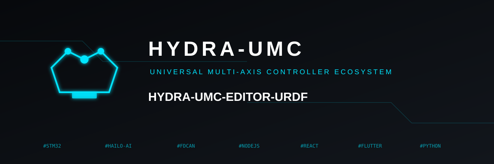

<p align="center">
  
</p>
# 🦾 HYDRA-UMC EDITOR-URDF

<p align="center">
  <a href="README.md">🇺🇸 English</a> |
  🇪🇸 <b>Español</b> |
  <a href="README_fra.md">🇫🇷 Français</a> |
  <a href="README_ita.md">🇮🇹 Italiano</a> |
  <a href="README_deu.md">🇩🇪 Deutsch</a> |
  <a href="README_zho.md">🇨🇳 简体中文</a> |
  <a href="README_jpn.md">🇯🇵 日本語</a>
</p>


<p align="left">
  
  
  
  
</p>


### 🖌️ Creador/Editor Gráfico de URDF para el Catálogo de Modelos de HYDRA-UMC-STUDIO

**Versión actual:** 0.0.0 (`MAJOR.MINOR.PATCH` - ver la sección **Compilación de Producción** más abajo para saber cómo se mueve este número)

---

## 🎯 Visión General

**HYDRA-UMC EDITOR-URDF** es la herramienta de escritorio que convierte "portar un robot nuevo al catálogo de modelos de [HYDRA-UMC STUDIO](https://github.com/JuanenRac/HYDRA-UMC-STUDIO)" de una investigación manual, robot a robot, en un flujo de trabajo gráfico y repetible. Cada modelo de robot real en el catálogo de STUDIO llegó ahí de la misma forma en el pasado: encontrar un repositorio de descripción en GitHub, averiguar cómo se resuelven sus referencias a mallas, contar los grados de libertad de su cadena cinemática, comprobar si STUDIO realmente puede mover tantos, y colocar el resultado a mano en `public/models/`. Esta aplicación automatiza todo ese proceso: extrae los archivos fuente desde una URL de GitHub o desde una carpeta local ya descargada, resuelve cada referencia `<mesh filename="...">` (URIs `package://` incluidas) contra los archivos reales en disco, valida el número de grados de libertad de la cadena contra lo que la cinemática de STUDIO soporta hoy, edita color/escala/límites de junta/tipo de junta con una vista previa 3D en vivo, y sube el resultado terminado directamente a un servidor STUDIO en ejecución.

Construida con **Python** y **PySide6/Qt6**, usando los mismos patrones arquitectónicos ya validados en la otra herramienta de escritorio de este ecosistema, [HYDRA-UMC SUITE](https://github.com/JuanenRac/HYDRA-UMC-SUITE): un espacio de trabajo acoplable al estilo Photoshop/Fusion-360 (`QDockWidget`), una vista 3D OpenGL escrita a mano (`QOpenGLWidget` + shaders GLSL 3.3 core-profile, sin la ruta heredada `glBegin`/`glEnd`), y un único objeto controlador central que posee el estado y al que cada panel de la interfaz escucha mediante señales de Qt. Reutilizar ese patrón aquí -en vez de explorar una pila de UI/renderizado nueva para una herramienta hermana en el mismo ecosistema- es una decisión deliberada, no un descuido.

**Nota de honestidad, siguiendo la misma convención de documentación que el resto de este ecosistema:** esta aplicación no expande macros [xacro](http://wiki.ros.org/xacro), ni carga mallas COLLADA (`.dae`). Ambas son limitaciones nombradas y explícitas (un mensaje de error claro, no un mal-parseo silencioso o un enlace faltante en la vista) en vez de un intento a medio implementar - ver las secciones **Parseo de URDF** y **Carga de Mallas** más abajo para el porqué, y lo que costaría dar soporte real a cualquiera de las dos.

---

## 📥 Carga de Fuentes - GitHub o Carpeta Local

Dos formas de apuntar la aplicación a los archivos fuente de un robot, ambas terminando en la misma ruta de importación:

- **Desde una URL de GitHub** - acepta una URL completa `https://github.com/owner/repo` (con o sin `/tree/<branch>`), un formato estilo SSH `git@github.com:owner/repo.git`, o el atajo simple `owner/repo`. Deliberadamente **no** invoca `git clone`, lo cual convertiría una instalación de `git` en una dependencia dura en tiempo de ejecución tanto en Windows como en Linux para algo que una simple descarga HTTPS ya resuelve: GitHub sirve un zipball de cualquier rama/tag/commit desde `codeload.github.com` sin necesidad de autenticación para un repositorio público, así que esto usa el propio `urllib.request` + `zipfile` de la biblioteca estándar y nada más. Solo se soportan repositorios públicos - no hay manejo de tokens/credenciales, y el zipball de un repositorio privado da un 404 igual que uno inexistente.
- **Desde una carpeta local** - para un repositorio ya descargado a mano, o una copia de trabajo que el operador está editando activamente fuera de esta aplicación.

De cualquier forma, la aplicación después busca recursivamente cada archivo `*.urdf`/`*.xacro` bajo la carpeta elegida, los lista todos (un repositorio real de descripción de robot a menudo trae más de uno - un brazo desnudo más una variante "con pinza" es un emparejamiento habitual), y elige automáticamente el de mayor tamaño de archivo como valor por defecto razonable para "el principal" - cambiar a otro candidato después es un doble clic en el panel Source, no una nueva descarga.

**La resolución de referencias a mallas** es el trabajo poco glamuroso que toda sesión pasada de portado manual de robots en este ecosistema hizo a mano: un `<mesh filename="package://some_pkg/meshes/link1.stl"/>` de un URDF prácticamente nunca es una ruta abrible directamente una vez que el archivo está sentado en una simple carpeta descargada en vez de un espacio de trabajo ROS en vivo, donde `package://` se resuelve a través del índice de paquetes de ROS. El resolvedor prueba, en orden: (1) la referencia como una ruta relativa a la propia carpeta del URDF, (2) la misma referencia quitando el segmento inicial de nombre de paquete al estilo `package://`, (3) como ruta absoluta si resulta que ya lo es, y (4) por nombre base a secas en cualquier lugar bajo la carpeta fuente - que es lo que realmente maneja una URI `package://` real, ya que el esquema y el nombre del paquete no significan nada fuera de un espacio de trabajo ROS en vivo, pero el propio nombre de archivo de la malla sigue siendo localizable.

---

## ✅ Validación de Viabilidad de DOF

La versión automatizada del mismo juicio que las propias sesiones pasadas de este ecosistema hicieron a mano para cada robot añadido al catálogo de STUDIO: **la propia cinemática de STUDIO soporta hoy cadenas seriales de 3, 4, 5 y 6 DOF** (su `RobotState.joints` es un mapa fijo `j1..j6`) - un puñado de brazos candidatos reales, con licencia clara, investigados en el pasado resultaron ser de 7, 8 o 9 DOF y fueron descartados exactamente por esta razón, no hipotéticamente. En cada importación (y después de cada edición en vivo que pueda cambiar el recuento - retipar una junta, por ejemplo), la aplicación recorre el grafo real de juntas padre/hijo e informa:

- **Recuento de DOF** - solo las juntas `revolute`/`continuous`/`prismatic` cuentan como un grado de libertad real y controlable; `fixed` no aporta ninguno.
- **Tipos de junta no soportados** - una sola junta `floating` o `planar` en cualquier lugar de la cadena hace que todo el robot sea inviable sin importar el recuento de DOF, ya que el modelo de juntas de STUDIO no tiene representación para ninguna de las dos.
- **Integridad del árbol** - se requiere exactamente un enlace raíz (un árbol propio, no un bosque ni un ciclo); cualquier enlace no alcanzable desde esa raíz por una cadena de juntas se marca como desconectado, y cualquier enlace al que ninguna junta hace referencia en absoluto se marca como huérfano.
- **`<limit>` faltante** - requerido por la especificación URDF para cualquier junta que no sea `continuous`; se marca por junta si está ausente.

El veredicto y cada razón detrás de él se renderizan en vivo en el panel DOF, y el panel Upload rechaza subir un robot inviable a un servidor.

---

## 🎨 Edición en Vivo con una Vista Previa 3D Real

El panel Properties edita el enlace que esté seleccionado en el árbol de enlaces del panel Viewport, y cada edición muta el modelo cargado in situ y revalida/vuelve a renderizar a través de una sola señal (`EditorController.notify_tree_changed`) - ningún panel necesita saber cómo reacciona el viewport o el informe de DOF a su propia edición:

- **Recolorear** - el material visual de un enlace, elegido mediante un diálogo de color estándar. Un material compartido por nombre entre varios enlaces (una declaración `<material name="...">` de nivel superior de un URDF real, referenciada por más de un `<visual>`) recolorea juntos a todos los enlaces que lo comparten, respetando lo que esa sintaxis de material compartido realmente significa en la especificación.
- **Reescalar** - factor de escala por eje (X/Y/Z) sobre la propia transformación `<mesh scale="...">` de una geometría de malla, no una reescritura destructiva de los propios datos de triángulos de la malla - la misma edición vuelta a aplicar más tarde parte siempre de la malla original, sin modificar.
- **Retipar y re-limitar una junta** - cambiar el tipo de una junta (cualquiera de los 6 que define la especificación URDF) y su límite inferior/superior, con el veredicto del panel DOF actualizándose de inmediato ya que un retipado puede cambiar el recuento de DOF o introducir un tipo no soportado.

El **panel Viewport** aloja la propia vista 3D OpenGL más un control deslizante de jog por cada junta móvil, para que el operador pueda previsualizar el URDF moviéndose por su propio rango real antes de tocar STUDIO. La cinemática directa (`render/kinematics.py`) es genérica sobre cualquier árbol que se acabe de importar - a diferencia del propio módulo de cinemática de HYDRA-UMC SUITE, que maneja un registro fijo de unas pocas docenas de modelos de robot conocidos y verificados a mano, esta aplicación tiene que posar un URDF arbitrario, nunca antes visto, así que compone el propio `<origin>`/`<axis>` real de cada junta (fórmula de rotación de Rodrigues para un eje revolute arbitrario, no solo el atajo de dirección cardinal en el que podría apoyarse un registro fijo) recorriendo el propio grafo padre/hijo.

**Z-arriba, no Y-arriba** - la única divergencia deliberada respecto a la propia convención de viewport de HYDRA-UMC SUITE: URDF en sí mismo es un formato Z-arriba (la gravedad es `-Z`, cada `<origin>`/`<axis>` en un archivo fuente está redactado asumiendo eso), y el trabajo de esta aplicación es mostrar y editar un URDF fielmente en su propia convención, no reorientarlo hacia lo que un visor posterior (la escena Three.js de STUDIO, la propia escena OpenGL de SUITE) prefiera tener.

---

## 🗂️ Carga de Mallas

`.stl` (vía `numpy-stl`) y `.obj` (un pequeño cargador Wavefront escrito a mano - solo `v`/`vn`/`f`, caras n-gon trianguladas en abanico) son ambos de primera clase. **COLLADA (`.dae`) no está soportado** - es un formato de grafo de escena XML mucho más grande (animación esquelética, múltiples sistemas de coordenadas, materiales/texturas embebidos) que necesitaría un parser real para manejarse con honestidad en vez de una conjetura de mejor esfuerzo sobre cualesquiera etiquetas que use un `.dae` "simple"; un enlace que referencia uno recibe un error claro y nombrado en vez de desaparecer silenciosamente del viewport o hacer fallar toda la importación. Cada malla cargada también recibe la misma protección defensiva milímetros-contra-metros que aplican el propio `useRealScaleSTL()` de HYDRA-UMC STUDIO y el propio cargador de mallas de HYDRA-UMC SUITE: un enlace más grande que 5 metros reales en cualquier eje es mucho más probable que sea una exportación a escala de milímetros sin metadatos de unidad que una pieza de robot realmente gigante, y se reescala automáticamente por 0.001.

---

## 📜 Parseo y Exportación de URDF

XML plano vía el propio `xml.etree.ElementTree` de la biblioteca estándar - no se necesita una dependencia de `lxml` para un formato tan simple. El modelo en memoria (`hydra_editor_urdf/models.py`) es deliberadamente un árbol de dataclasses propio, plano y mutable, en vez de un envoltorio sobre una biblioteca Python de URDF ya existente como `urdfpy` o `yourdfpy`: esta aplicación necesita *editar* el árbol de forma interactiva y volver a renderizar cada cambio en vivo, algo para lo que una biblioteca de parseo pensada mayormente para lectura no está diseñada, y ser dueño del modelo por completo lo mantiene pequeño, inspeccionable y libre del propio ritmo de publicación de una dependencia de terceros. Los nombres de campo y los valores por defecto siguen de cerca el [esquema XML real de URDF](http://wiki.ros.org/urdf/XML), así que el par parser/writer se mantiene como un mapeo XML↔objeto delgado y evidente.

**xacro no se expande.** [xacro](http://wiki.ros.org/xacro) es un preprocesador de macros Python/XML con su propio paquete ROS y cadena de dependencias, y un archivo xacro real solo se puede resolver de forma fiable dentro del mismo entorno de paquete ROS contra el que fue redactado (argumentos de macro, includes al estilo `$(find pkg)`, etc.) - algo que esta aplicación no tiene forma de reproducir con honestidad. Un archivo que use etiquetas `<xacro:...>` o declare el namespace de xacro recibe un error claro que explica la limitación y señala hacia la herramienta de línea de comandos `xacro` de ROS para preprocesarlo primero, en vez de un mal-parseo silencioso.

La exportación (`urdf/writer.py`) reserializa el árbol actual en memoria desde cero en vez de parchear el texto XML fuente original, así que cada edición en vivo -sin importar qué panel la hizo- se refleja exactamente una vez, a través de una sola ruta de código, tanto en la acción de menú "Export URDF" como en el payload enviado a un servidor STUDIO.

---

## 🖥️ Espacio de Trabajo Acoplable

Paneles `QDockWidget` reales - arrastrar para flotar, arrastrar de vuelta para acoplar, fusionar en pestañas, dividir el espacio de trabajo - el mismo mecanismo y razonamiento que la propia ventana principal de HYDRA-UMC SUITE ya aplica: el propio sistema de acoplamiento de Qt ya hace exactamente lo que un espacio de trabajo al estilo Photoshop/Fusion-360 necesita, y uno hecho a mano solo lo reinventaría con más errores. Cinco paneles, dispuestos con una disposición por defecto sensata que es completamente reorganizable después:

- **Source** - entrada de URL de GitHub / carpeta local, lista de `.urdf` encontrados.
- **DOF** - el veredicto de viabilidad y cada razón detrás de él.
- **Viewport** - la vista 3D en vivo, el árbol de enlaces, y los controles deslizantes de jog.
- **Properties** - recolorear / reescalar / retipar-y-re-limitar para el enlace seleccionado.
- **Upload** - conectar a un servidor STUDIO, subir, o descargar.

---

## ☁️ Ida y Vuelta con el Servidor

Habla con el propio contrato de envío de modelos de HYDRA-UMC-SERVER (`POST /api/models/submit`, `GET /api/models`, `GET /api/models/:category/:slug/download` en el propio `server.ts` de ese proyecto, protegido tras su propio interruptor **Config > Models > "Accept model submissions"**) usando el propio `urllib.request` de la biblioteca estándar - una llamada HTTP más no justificaba traer `httpx`/`requests` para un proyecto que solo necesita 4 endpoints, no una conexión en vivo persistente. Cada llamada corre en un `QThread` en segundo plano para que un servidor lento o inalcanzable nunca congele la interfaz. Este contrato solía vivir dentro del propio proceso de HYDRA-UMC-STUDIO antes de que ese proyecto se dividiera en un frontend puro (STUDIO) más un backend headless separado (HYDRA-UMC-SERVER, ver **Proyectos Relacionados** más abajo) - esta app no fija ningún nombre por código, el operador simplemente apunta los campos host/puerto del panel **Upload** a donde esté corriendo el backend real.

- **Login** - `POST /api/login`; solo un token con rol `admin` puede realmente alcanzar `POST /api/models/submit` en el lado del servidor, así que esta aplicación solo es realmente usable contra una cuenta admin, igual que cualquier otra función de STUDIO exclusiva para administradores.
- **Push** - serializa el robot actual de vuelta a XML URDF y codifica en base64 cada archivo de malla que sus visuales referencian (resuelto a través del mismo resolvedor de mallas construido en el momento de importar) inline en el cuerpo de la petición, etiquetado con la categoría elegida por el operador (reflejando las propias categorías de Config > UI > Module Visibility de STUDIO: Robot 3-6DOF, CNC, Pick & Place, Laser, Vacuum Table, XY Table, Heated Bed, ATC Tools - un URDF no tiene un campo propio que diga cuál de estas es). Una colisión de nombre vuelve como la propia respuesta 409 del servidor; el operador decide si reenviar con **Overwrite** marcado o renombrar, esta aplicación nunca adivina.
- **Pull** - descarga el URDF + mallas de un modelo ya enviado de vuelta a una carpeta de trabajo local y lo carga directamente en el editor - la mitad "extraer, editar, reenviar" del propio propósito de esta aplicación, permitiendo retocar una entrada de catálogo existente sin volver a empezar desde su repositorio fuente original.

---

## 🌐 Interfaz Multi-Idioma

Traducción completa de la interfaz a través de **inglés, español, italiano, francés y alemán** (`language/*.lng`), usando exactamente el mismo mecanismo de archivo plano `CLAVE=Valor` que cualquier otra herramienta Python de este ecosistema (URTC Flasher, URTC Tester, HYDRA-UMC SUITE) - no reinventado aquí, ya que el propio mecanismo no lleva ninguna lógica específica del proyecto. Un cambio de idioma surte efecto después de reiniciar la aplicación en vez de retraducir en vivo cada widget ya construido, siguiendo esa misma convención. `language/` está **junto a** el ejecutable en vez de empaquetado dentro de él vía el `--add-data` de PyInstaller, así que un traductor puede editar o añadir un archivo `.lng` sin necesidad de recompilar.

---

## 🎛️ Tema

Reutiliza el propio `assets/qss/industrial_dark.qss` de HYDRA-UMC SUITE tal cual (misma ruta relativa, mismo archivo) en vez de diseñar un tema visual nuevo para una herramienta de escritorio hermana en el mismo ecosistema.

---

## 📂 Estructura del Repositorio

```text
HYDRA-UMC-EDITOR-URDF/
├── main.py                        # Punto de entrada - QApplication, tema, arranque maximizado, alternancia F11 de pantalla completa
├── requirements.txt                # PySide6, PyOpenGL, numpy-stl, numpy (con versiones fijadas)
├── build_exe.bat / build_exe.sh    # Scripts de compilación de ejecutable independiente para Windows/Linux (PyInstaller) - primero sube la versión
├── bump_version.py                 # Subida de versión al estilo cuentakilómetros, llamado por build_exe.bat/.sh antes de cada compilación real
├── CHANGELOG.md                    # Historial de versiones
├── README.md                       # Este archivo
├── README_spa.md / README_ita.md / README_fra.md / README_deu.md / README_zho.md / README_jpn.md  # <- traducciones
├── LICENSE                         # GPL-3.0
├── assets/
│   └── qss/industrial_dark.qss     # Reutilizado tal cual desde HYDRA-UMC-SUITE
├── language/                       # english/spanish/italian/french/german.lng - junto al exe, no empaquetado dentro
├── hydra_editor_urdf/
│   ├── __init__.py                 # __version__ - única fuente de verdad, leída por el diálogo Acerca de y reescrita por bump_version.py
│   ├── app.py                      # EditorController - único dueño de "qué está cargado", señales Qt que escucha cada panel
│   ├── models.py                   # Árbol de objetos URDF propio (Robot/Link/Joint/Visual/Geometry/Material/...)
│   ├── i18n.py                     # Cargador de language/*.lng, persistencia de configuración - portado desde el propio i18n.py de HYDRA-UMC-SUITE
│   ├── urdf/
│   │   ├── parser.py               # Árbol URDF XML -> models.py (ElementTree, xacro detectado y rechazado con un error claro)
│   │   ├── writer.py                # Árbol models.py -> cadena XML URDF (exportación + payload de subida al servidor)
│   │   └── dof.py                  # Recuento de DOF, validación de viabilidad contra el tope de 3-6 DOF de STUDIO
│   ├── render/
│   │   ├── mesh.py                 # Carga de STL/OBJ, generación de primitivas caja/cilindro/esfera, protección mm-contra-m
│   │   ├── kinematics.py           # Cinemática directa genérica sobre un árbol importado arbitrario (Z-arriba, la propia convención de URDF)
│   │   └── viewport.py             # QOpenGLWidget - shader core GLSL 3.3, cámara orbital, buffers de GPU por enlace
│   ├── source/
│   │   ├── scan.py                 # Encuentra archivos .urdf/.xacro, construye el resolvedor de nombres de malla consciente de package://
│   │   ├── github_fetcher.py       # Descarga y extracción de zipball de GitHub (urllib + zipfile, sin dependencia de git)
│   │   └── local_folder.py         # Validación de carpeta local - la contraparte ligera de github_fetcher.py
│   ├── server/
│   │   └── client.py               # StudioClient - login/list_models/push_model/pull_model contra el server.ts de HYDRA-UMC-SERVER (el backend de STUDIO antes de que ambos repos se separaran)
│   └── ui/
│       ├── main_window.py          # QMainWindow - espacio de trabajo acoplable, barra de menú, selector de idioma, barra de estado
│       ├── theme.py                 # Aplica assets/qss/industrial_dark.qss
│       └── panels/
│           ├── source_panel.py     # Entrada de URL de GitHub / carpeta local, lista de URDF encontrados
│           ├── dof_panel.py        # Lectura del veredicto de viabilidad
│           ├── viewport_panel.py   # Alojamiento del viewport 3D, árbol de enlaces, controles deslizantes de jog
│           ├── properties_panel.py # Editores de recolorear / reescalar / retipar-y-re-limitar
│           └── upload_panel.py     # Conexión/subida/descarga con el servidor
├── docs/
│   ├── ARCHITECTURE.md
│   ├── BUILD_AND_RUN.md
│   └── INTEGRATION_CONTRACT.md
└── work/                            # Espacio de trabajo temporal en tiempo de ejecución para repositorios de GitHub extraídos y modelos descargados del servidor (ignorado por git)
```

---

## 🛠️ Entorno de Desarrollo

### Requisitos
- [Python](https://www.python.org/) 3.11 o superior
- pip

### Instalación

```bash
pip install -r requirements.txt
```

Esto trae el conjunto de dependencias con versiones fijadas: **PySide6** (interfaz Qt6), **PyOpenGL** (renderizado del viewport 3D), **numpy** / **numpy-stl** (matemática de mallas y carga de STL). No se requiere una instalación de `git` - la ruta de carga de fuentes de GitHub descarga un simple zipball por HTTPS.

### Modo de Desarrollo

```bash
python main.py
```

Arranca maximizado (no pantalla completa real a nivel de sistema operativo, así que la barra de título y los controles nativos de la ventana siguen visibles) - pulsa **F11** para alternar la pantalla completa real sin bordes y volver.

### Compilación de Producción

Compila un ejecutable independiente (no necesita una instalación de Python para ejecutarse) vía PyInstaller:

- **Windows:** ejecuta `build_exe.bat` → produce `dist\HYDRA-UMC_EDITOR-URDF.exe`
- **Linux:** ejecuta `./build_exe.sh` (`chmod +x build_exe.sh` una vez primero) → produce `dist/HYDRA-UMC_EDITOR-URDF`

Ambos scripts crean/activan su propio `.venv`, instalan `requirements.txt` más `pyinstaller`, limpian cualquier `build`/`dist` previo, **suben el número de versión**, compilan, y finalmente copian `README.md`, `LICENSE`, y toda la carpeta `language/` junto al binario resultante (`language/` deliberadamente **no** se empaqueta dentro del ejecutable vía `--add-data`, así que un archivo `.lng` se puede editar o añadir después sin necesidad de recompilar).

**Versionado:** la versión de la aplicación (`hydra_editor_urdf/__version__`, mostrada en el diálogo Ayuda → Acerca de) sigue el esquema `MAJOR.MINOR.PATCH`. Cada ejecución real de `build_exe.bat`/`build_exe.sh` llama primero a `bump_version.py`, que aplica una subida al estilo cuentakilómetros: `PATCH` sube en 1; en cuanto `PATCH` superaría 9 vuelve a 0 y en su lugar `MINOR` sube en 1 (p.ej. `0.0.9` → `0.1.0`). `MAJOR` nunca se toca automáticamente - eso sigue siendo una decisión manual y deliberada. Ver `CHANGELOG.md` para el historial de versiones.

Si prefieres ejecutar los pasos equivalentes a mano en vez del script -útil para adaptar la compilación a una plataforma que los scripts no cubren, o para depurar un flag de PyInstaller- el proceso manual es:

```bash
# 1. Crear y activar un entorno virtual
python -m venv .venv
# Windows: .venv\Scripts\activate.bat   |   Linux/Mac: source .venv/bin/activate

# 2. Instalar dependencias + PyInstaller
pip install -r requirements.txt
pip install pyinstaller

# 3. Localizar la propia carpeta de instalación de PySide6 (sus plugins Qt viven bajo ella)
python -c "import PySide6, os; print(os.path.dirname(PySide6.__file__))"
# -> $PYSIDE_DIR abajo

# 4. Compilar - solo se preparan explícitamente 4 subcarpetas de plugins Qt (platforms/
#    styles/imageformats/iconengines), NO --collect-all PySide6, que de otro modo
#    traería Qt6WebEngineCore.dll y otras piezas de varios cientos de MB que
#    esta aplicación nunca usa. El propio analizador de dependencias de PyInstaller
#    encuentra las verdaderas DLL de Qt6Core/Gui/Widgets/OpenGL siguiendo el grafo
#    de importación real de main.py - solo las carpetas de plugins hay que añadirlas a mano.
#
#    Windows (los plugins viven directamente bajo PySide6/plugins/):
pyinstaller --onefile --windowed --noconfirm --name "HYDRA-UMC_EDITOR-URDF" \
    --add-data "assets;assets" \
    --add-data "%PYSIDE_DIR%\plugins\platforms;PySide6\plugins\platforms" \
    --add-data "%PYSIDE_DIR%\plugins\styles;PySide6\plugins\styles" \
    --add-data "%PYSIDE_DIR%\plugins\imageformats;PySide6\plugins\imageformats" \
    --add-data "%PYSIDE_DIR%\plugins\iconengines;PySide6\plugins\iconengines" \
    --hidden-import PySide6.QtOpenGL --hidden-import PySide6.QtOpenGLWidgets \
    --hidden-import OpenGL.platform.win32 \
    main.py

#    Linux (los plugins viven bajo PySide6/Qt/plugins/ en su lugar - una disposición
#    distinta a la de Windows, confirmada leyendo el propio runtime hook de PyInstaller
#    pyi_rth_pyside6.py):
pyinstaller --onefile --noconfirm --name "HYDRA-UMC_EDITOR-URDF" \
    --add-data "assets:assets" \
    --add-data "$PYSIDE_DIR/Qt/plugins/platforms:PySide6/Qt/plugins/platforms" \
    --add-data "$PYSIDE_DIR/Qt/plugins/styles:PySide6/Qt/plugins/styles" \
    --add-data "$PYSIDE_DIR/Qt/plugins/imageformats:PySide6/Qt/plugins/imageformats" \
    --add-data "$PYSIDE_DIR/Qt/plugins/iconengines:PySide6/Qt/plugins/iconengines" \
    --hidden-import PySide6.QtOpenGL --hidden-import PySide6.QtOpenGLWidgets \
    main.py

# 5. Copiar los archivos que deben estar JUNTO AL binario, no dentro de él
cp README.md LICENSE dist/
cp -r language dist/language
```

En Linux, ejecutar el binario compilado necesita que el propio runtime de OpenGL del sistema esté presente (`libGL.so.1` - por ejemplo `libgl1` en Debian/Ubuntu, `mesa-libGL` en Fedora, `libglvnd` en Arch) más `libxkbcommon-x11-0`/`xcb-util-cursor` para el propio plugin de plataforma XCB de Qt; `build_exe.sh` comprueba `libGL.so.1` de antemano e imprime el comando de instalación correcto según la distribución si falta, en vez de fallar en lo profundo de una ejecución de PyInstaller.

---

## 🔗 Proyectos Relacionados

Este proyecto forma parte de un ecosistema de robótica más amplio del mismo autor (JuanenRac / Electro Hobby 3D). Vale la pena conocerlo, ya que una petición podría en realidad ser sobre uno de estos en vez de sobre este repositorio:

**Plataforma HYDRA-UMC** — la célula de microfábrica multi-robot
- **[HYDRA-UMC](https://github.com/JuanenRac/HYDRA-UMC)** — la propia placa base: host Raspberry Pi CM5 + coprocesador de tiempo real STM32H745 de doble núcleo, orquestando hasta 8 brazos de robot distribuidos vía CAN-OTA/SPI-OTA. Hardware + firmware propios, GPL-3.0/CERN-OHL-S v2/CC BY-SA 4.0.
- **[HYDRA-UMC STUDIO](https://github.com/JuanenRac/HYDRA-UMC-STUDIO)** — panel de control web para HYDRA-UMC: visualización 3D multi-robot, grabación de cinemática/trayectorias, flasheo y pruebas CAN-OTA para toda la plataforma. React + Vite + Three.js.
- **[HYDRA-UMC-SERVER](https://github.com/JuanenRac/HYDRA-UMC-SERVER)** — el backend headless (Node/Express/WebSocket) que antes iba empaquetado dentro del propio proceso de HYDRA-UMC-STUDIO. Es dueño de la API REST/WS de control de robots (incluyendo `POST /api/models/submit`, el endpoint al que este editor sube los modelos terminados), la persistencia de settings.json, la autenticación JWT y el descubrimiento mDNS. HYDRA-UMC-STUDIO es ahora un cliente frontend estático puro que se comunica con él por red.
- **[HYDRA-UMC-ANDROID-CONTROL](https://github.com/JuanenRac/HYDRA-UMC-ANDROID-CONTROL)** — aplicación de control Android para HYDRA-UMC vía Wi-Fi/Bluetooth. Aplicación real y funcional - conjunto completo de funciones de control remoto, autenticación JWT, almacenamiento cifrado de credenciales.
- **[HYDRA-UMC-IOS-CONTROL](https://github.com/JuanenRac/HYDRA-UMC-IOS-CONTROL)** — aplicación de control iOS/iPadOS para HYDRA-UMC vía Wi-Fi, construida en Flutter (multiplataforma, verificable en Windows sin necesidad de un Mac; el empaquetado final `.ipa` sigue necesitando Xcode). Aplicación real y funcional - mismo conjunto de funciones que la aplicación Android.
- **[HYDRA-UMC-SUITE](https://github.com/JuanenRac/HYDRA-UMC-SUITE)** — centro de mando de escritorio (Python/PySide6) para el enjambre: descubrimiento de red multi-controlador, sincronización bidireccional en vivo, viewport 3D de robot real, espacio de trabajo acoplable al estilo Photoshop. Real y funcional, no un placeholder.
- **HYDRA-UMC-EDITOR-URDF** *(este repositorio)* — creador/editor gráfico de URDF de escritorio (Python/PySide6) para el propio catálogo de modelos de HYDRA-UMC-STUDIO: extrae archivos fuente desde GitHub o una carpeta local, valida la viabilidad de DOF, edita color/escala/cinemática con una vista previa 3D en vivo, y sube el resultado terminado a un servidor STUDIO en ejecución. Real y funcional, no un placeholder.
- **[HYDRA-UMC-DSI](https://github.com/JuanenRac/HYDRA-UMC-DSI)** — UI táctil nativa en Flutter para la propia pantalla táctil DSI de 5"/7" de HYDRA-UMC (1280×720, misma resolución en ambos tamaños) en la Compute Module 5, controlando este mismo servidor directamente desde la placa. Scaffold real y funcional con las 6 pantallas del catálogo (dashboard, control manual, cámara, vista 3D simplificada, métricas de sistema, login) conectadas al servidor en vivo; el build real del target Linux aún no se ha ejecutado en hardware real (entorno de trabajo solo Windows hasta ahora - ver el README propio de ese proyecto).

**Plataforma URTC** — el controlador de cabezal de herramienta que lleva cada brazo de robot HYDRA-UMC
- **[URTC](https://github.com/JuanenRac/URTC)** — Universal Robot Tool Controller: controlador de cabezal de herramienta con bus CAN basado en STM32F303, 25 perfiles de herramienta completamente implementados, actualización de firmware CAN-OTA.
- **[URTC Flasher](https://github.com/JuanenRac/URTC-FLASHER)** — herramienta de escritorio de flasheo CAN-OTA + SWD/JTAG de chip completo para placas URTC (Windows/Linux).
- **[URTC Tester](https://github.com/JuanenRac/URTC-TESTER)** — herramienta de escritorio de diagnóstico en vivo por bus CAN para placas URTC, un panel por perfil de herramienta (Windows/Linux).
- **[URTC Web Studio](https://github.com/JuanenRac/URTC-WEB-STUDIO)** — alternativa basada en navegador a las 2 herramientas de escritorio de arriba (Web Serial API + SLCAN), sin necesidad de instalación local.

**Directamente relacionados con este repositorio**
- **[HYDRA-UMC-TWIN](https://github.com/JuanenRac/HYDRA-UMC-TWIN)** — consume los modelos URDF creados aquí para alimentar su simulación física.
- **[HYDRA-UMC-PHYSICS-REPLICA](https://github.com/JuanenRac/HYDRA-UMC-PHYSICS-REPLICA)** — consume los modelos URDF creados aquí para alimentar su simulación física.
- **[HYDRA-UMC-SYNTHETIC-DATA-GEN](https://github.com/JuanenRac/HYDRA-UMC-SYNTHETIC-DATA-GEN)** — genera datos de entrenamiento a partir de los modelos creados aquí.

**Resto del ecosistema** — este proyecto se sitúa dentro de un conjunto más amplio de muchos proyectos, agrupados por área:
- 👁️ **Vision AI Node (Hailo-8):** [HYDRA-UMC-VISION-NODE](https://github.com/JuanenRac/HYDRA-UMC-VISION-NODE), [HYDRA-UMC-VISION-STREAMER](https://github.com/JuanenRac/HYDRA-UMC-VISION-STREAMER), [HYDRA-UMC-DETECTION-HEF](https://github.com/JuanenRac/HYDRA-UMC-DETECTION-HEF), [HYDRA-UMC-SAFETY-ZONES](https://github.com/JuanenRac/HYDRA-UMC-SAFETY-ZONES), [HYDRA-UMC-VISUAL-SERVOING-API](https://github.com/JuanenRac/HYDRA-UMC-VISUAL-SERVOING-API)
- 🧠 **Cognitive AI Node (Hailo-10):** [HYDRA-UMC-COGNITIVE-NODE](https://github.com/JuanenRac/HYDRA-UMC-COGNITIVE-NODE), [HYDRA-UMC-VLA-ENGINE](https://github.com/JuanenRac/HYDRA-UMC-VLA-ENGINE), [HYDRA-UMC-VOICE-UI](https://github.com/JuanenRac/HYDRA-UMC-VOICE-UI), [HYDRA-UMC-SEMANTIC-PLANNER](https://github.com/JuanenRac/HYDRA-UMC-SEMANTIC-PLANNER), [HYDRA-UMC-DOCS-QA](https://github.com/JuanenRac/HYDRA-UMC-DOCS-QA)
- 🐝 **Orchestration & Swarm:** [HYDRA-UMC-ORCHESTRATOR](https://github.com/JuanenRac/HYDRA-UMC-ORCHESTRATOR), [HYDRA-UMC-SWARM-SYNC](https://github.com/JuanenRac/HYDRA-UMC-SWARM-SYNC), [HYDRA-UMC-PATH-PLANNER-3D](https://github.com/JuanenRac/HYDRA-UMC-PATH-PLANNER-3D), [HYDRA-UMC-JOB-DISPATCHER](https://github.com/JuanenRac/HYDRA-UMC-JOB-DISPATCHER), [HYDRA-UMC-NODE-HEALING](https://github.com/JuanenRac/HYDRA-UMC-NODE-HEALING)
- 🎮 **Digital Twin & Simulation:** [HYDRA-UMC-HIL-BRIDGE](https://github.com/JuanenRac/HYDRA-UMC-HIL-BRIDGE)
- 📊 **Data & Analytics:** [HYDRA-UMC-DATALAKE](https://github.com/JuanenRac/HYDRA-UMC-DATALAKE), [HYDRA-UMC-TELEMETRY-COLLECTOR](https://github.com/JuanenRac/HYDRA-UMC-TELEMETRY-COLLECTOR), [HYDRA-UMC-ANOMALY-DETECTOR](https://github.com/JuanenRac/HYDRA-UMC-ANOMALY-DETECTOR), [HYDRA-UMC-PRODUCTION-REPORTS](https://github.com/JuanenRac/HYDRA-UMC-PRODUCTION-REPORTS)
- 🏭 **Industrial Gateway:** [HYDRA-UMC-GATEWAY-INDUSTRIAL](https://github.com/JuanenRac/HYDRA-UMC-GATEWAY-INDUSTRIAL), [HYDRA-UMC-OPCUA-SERVER](https://github.com/JuanenRac/HYDRA-UMC-OPCUA-SERVER), [HYDRA-UMC-MQTT-BROKER](https://github.com/JuanenRac/HYDRA-UMC-MQTT-BROKER), [HYDRA-UMC-MTCONNECT-ADAPTER](https://github.com/JuanenRac/HYDRA-UMC-MTCONNECT-ADAPTER)
- 🛠️ **Complementary Tools:** [URTC-SMART-RACK](https://github.com/JuanenRac/URTC-SMART-RACK), [URTC-VISION-TOOL](https://github.com/JuanenRac/URTC-VISION-TOOL), [HYDRA-UMC-WATCH](https://github.com/JuanenRac/HYDRA-UMC-WATCH), [HYDRA-UMC-TOOL-CLI](https://github.com/JuanenRac/HYDRA-UMC-TOOL-CLI), [HYDRA-UMC-DASHBOARD-AI](https://github.com/JuanenRac/HYDRA-UMC-DASHBOARD-AI)

---

## 👤 Autor

**JuanenRac** (Electro Hobby 3D)
📧 electrohobby3d@gmail.com
📺 youtube.com/@electrohobby3d

---

## 📜 Licencia y Avisos de Copyright

HYDRA-UMC EDITOR-URDF es (c) 2026 JuanenRac (Electro Hobby 3D). Este aviso debe incluirse en cualquier distribución de este proyecto o trabajos derivados.

Este proyecto consiste en código fuente y su propia documentación, disponibles bajo licencias distintas - cada una adecuada a lo que realmente cubre:

1. El código fuente (`hydra_editor_urdf/`, `main.py`, y cualquier binario compilado a partir de él vía `build_exe.bat`/`build_exe.sh`) está disponible bajo la **GNU General Public License v3.0 (GPL-3.0)**. Texto completo en https://www.gnu.org/licenses/gpl-3.0.html.

2. La documentación (este README y sus propias traducciones - `README_spa.md`, `README_ita.md`, `README_fra.md`, `README_deu.md`, `README_zho.md`, `README_jpn.md`) está disponible bajo **Creative Commons Attribution-ShareAlike 4.0 International (CC BY-SA 4.0)**. Texto completo en https://creativecommons.org/licenses/by-sa/4.0/.

Esta aplicación no distribuye assets de malla de robot de terceros propios - a diferencia del propio `public/models/` de HYDRA-UMC STUDIO, cada malla que este editor llega a cargar proviene de cualquier repositorio fuente o carpeta local hacia el que el operador lo apunte, bajo la propia licencia original de esa fuente. Revisar y preservar esa licencia/atribución previa antes de enviar un modelo a un servidor STUDIO en ejecución (cuya propia convención `public/models/<slug>/ATTRIBUTION.txt` alimenta la función de exportación de este editor) sigue siendo responsabilidad propia del operador - esta aplicación no tiene forma de detectar o hacer cumplir automáticamente los términos de licencia de un repositorio fuente.

Este editor es la herramienta de creación de modelos para el catálogo de [HYDRA-UMC STUDIO](https://github.com/JuanenRac/HYDRA-UMC-STUDIO) - ver ese repositorio para su propia licencia del lado del servidor, a la que la propia licencia de este repositorio no se extiende, y viceversa.

Si construyes sobre este proyecto, ten en cuenta la separación de licencias: los cambios de código aquí deberían mantenerse GPL-3.0, los derivados de documentación (este README y sus traducciones) deberían mantenerse CC BY-SA 4.0, y cualquier asset de malla que pase por este editor (importado, editado, o exportado) debería mantenerse bajo cualquier licencia que lleve su propio repositorio fuente original, con atribución de vuelta a esa fuente.
</content>
